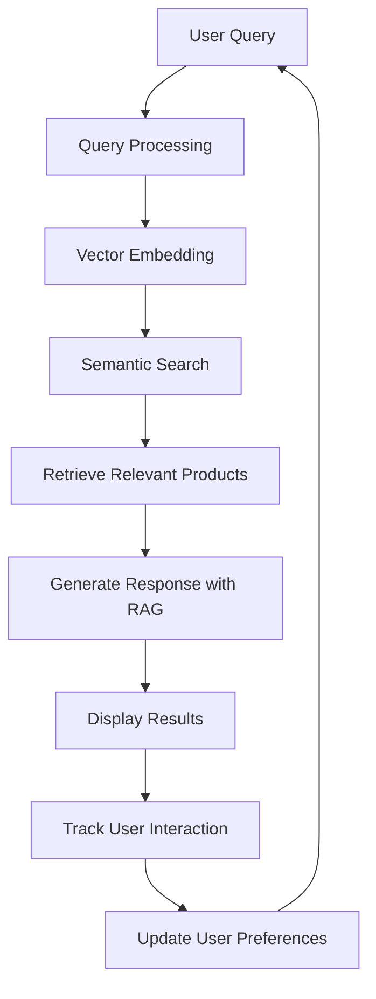

# 🛍️ E-commerce Product Recommendation RAG System

[](https://www.python.org/downloads/)
[](https://streamlit.io/)
[](https://opensource.org/licenses/MIT)

A state-of-the-art Retrieval-Augmented Generation (RAG) system that revolutionizes e-commerce product discovery. This system combines multi-source product data with advanced AI to deliver intelligent recommendations and comparisons.

## 🔍 Demo

[](https://your-streamlit-app-url.streamlit.app/)

https://github.com/yourusername/ecommerce-rag/assets/12345678/example-gif

*Screenshot: Interactive product comparison and recommendation interface*

## ✨ Core Features

### 🔍 Smart Product Search
- Natural language understanding for product searches
- Semantic search across product titles, descriptions, and specifications
- Faceted filtering by price range, brand, and categories

### 🎯 Personalized Recommendations
- Learns from user interactions (views, clicks, comparisons)
- Adaptive recommendations based on behavior patterns
- Context-aware suggestions based on current session

### 🔄 Interactive Product Comparison
- Side-by-side feature comparison
- Visual representation of product differences
- Review sentiment analysis for each product
- Authenticity scoring for reviews

### 📊 Sentiment & Quality Analysis
- Aspect-based sentiment analysis of reviews
- Review authenticity scoring
- Spam and fake review detection
- Summary of customer opinions

### 🧠 Intelligent RAG Pipeline
- Retrieval-Augmented Generation for context-aware responses
- Multi-vector search across product aspects
- Dynamic response generation with relevant product context

## 🛠️ Technical Stack

### Backend
- **Python 3.8+** - Core programming language
- **ChromaDB** - Vector database for semantic search
- **Sentence Transformers** - For generating text embeddings
- **NLTK** - Text processing and analysis
- **Pandas** - Data manipulation and analysis

### Frontend
- **Streamlit** - Web application framework
- **Plotly** - Interactive data visualizations
- **Streamlit Components** - Enhanced UI elements

### Machine Learning
- **HuggingFace Transformers** - For advanced NLP tasks
- **Scikit-learn** - For ML utilities and metrics
- **NLTK** - For text processing

### Deployment
- **Docker** - Containerization
- **Streamlit Cloud** - Hosting platform
- **GitHub Actions** - CI/CD pipeline

## 🏆 Features in Detail

### Advanced Search & Discovery
- Natural language product search
- Semantic understanding of queries
- Faceted filtering by price, brand, and category

### Personalized Experience
- Learns from user interactions (views, purchases, wishlists)
- Tracks user preferences over time
- Adapts recommendations based on behavior

### Smart Product Comparisons
- Side-by-side feature comparison
- Review sentiment analysis
- Authenticity scoring for reviews
- Visual representation of differences

### Sentiment & Quality Analysis
- Aspect-based sentiment analysis
- Review authenticity scoring
- Spam and fake review detection
- Summary of customer opinions

## 🏗️ System Architecture



## 🗂️ Project Structure

```
ecommerce_rag/
├── data/                    # Sample product data and user preferences
│   ├── raw/                 # Raw data files
│   └── processed/           # Processed data and embeddings
│
├── src/                     # Source code
│   ├── analysis/            # Sentiment and quality analysis
│   ├── data_processing/     # Data loading and preprocessing
│   ├── embedding/           # Text embedding models
│   ├── generation/          # Response generation and RAG pipeline
│   ├── learning/            # User preference learning
│   ├── retrieval/           # Vector database and retrieval logic
│   └── utils/               # Utility functions
│
├── app/                     # Web application
│   ├── static/              # Static assets (CSS, images)
│   ├── components/          # Reusable UI components
│   └── main.py              # Main application file
│
├── tests/                   # Unit and integration tests
│   ├── unit/                # Unit tests
│   └── integration/         # Integration tests
│
├── .github/                 # GitHub Actions workflows
├── .streamlit/              # Streamlit configuration
├── Dockerfile               # Container configuration
├── requirements.txt         # Python dependencies
├── setup.py                # Package configuration
└── README.md               # This file
```

## 🤝 Contributing

We welcome contributions! Please follow these steps:

1. Fork the repository
2. Create a feature branch (`git checkout -b feature/amazing-feature`)
3. Commit your changes (`git commit -m 'Add some amazing feature'`)
4. Push to the branch (`git push origin feature/amazing-feature`)
5. Open a Pull Request

## 📄 License

This project is licensed under the MIT License - see the [LICENSE](LICENSE) file for details.

## 🙏 Acknowledgments

- Built with [Streamlit](https://streamlit.io/)
- Uses [Sentence Transformers](https://www.sbert.net/) for embeddings
- Inspired by modern recommendation systems in e-commerce

## 📧 Contact

For questions or feedback, please open an issue or contact [your-email@example.com](mailto:your-email@example.com)

## 🚀 Quick Start

### Prerequisites
- Python 3.8 or higher
- pip (Python package manager)
- Git
- (Optional) Docker for containerized deployment

### Local Development Setup

1. **Clone the repository**
   ```bash
   git clone https://github.com/yourusername/ecommerce-rag.git
   cd ecommerce-rag
   ```

2. **Set up a virtual environment**
   ```bash
   # Windows
   python -m venv venv
   .\venv\Scripts\activate
   
   # macOS/Linux
   python3 -m venv venv
   source venv/bin/activate
   ```

3. **Install Python dependencies**
   ```bash
   pip install -r requirements.txt
   ```
   
4. **Download NLTK data**
   ```bash
   python -c "import nltk; nltk.download('punkt'); nltk.download('stopwords')"
   ```

5. **Initialize the system**
   ```bash
   # This will load sample data and initialize the vector store
   python -c "from app.main import initialize_system; initialize_system()"
   ```

6. **Run the application**
   ```bash
   streamlit run app/main.py
   ```

7. **Access the web interface**
   Open your browser and navigate to:
   ```
   http://localhost:8501
   ```

### Using Docker

1. **Build the Docker image**
   ```bash
   docker build -t ecommerce-rag .
   ```

2. **Run the container**
   ```bash
   docker run -p 8501:8501 ecommerce-rag
   ```

3. **Access the application**
   Open your browser and navigate to:
   ```
   http://localhost:8501
   ```

## 📚 Usage Guide

### 1. Product Search
- Enter natural language queries in the search bar (e.g., "affordable wireless headphones with noise cancellation")
- Use filters to narrow down results by price, brand, or category
- Click on any product card to view detailed information

### 2. Product Comparison
- Select up to 3 products to compare
- View side-by-side feature comparison
- Analyze review sentiments and authenticity scores

### 3. Personalized Recommendations
- The system learns from your interactions
- View personalized recommendations on the home page
- Your preference profile updates automatically

### 4. Review Analysis
- See sentiment analysis for each review
- Authenticity scores help identify genuine feedback
- Review summaries provide quick insights

## ☁️ Deployment Options

### Option 1: Streamlit Cloud (Recommended)

1. **Fork this repository** to your GitHub account
2. Sign up for a free [Streamlit Cloud](https://streamlit.io/cloud) account
3. Click "New app" and connect your forked repository
4. Configure the app:
   - Select the main branch
   - Set the main file to `app/main.py`
   - Add any required secrets (API keys, etc.)
5. Click "Deploy!"

### Option 2: Docker Deployment

1. **Build the production image**
   ```bash
   docker build -t ecommerce-rag:prod -f Dockerfile.prod .
   ```

2. **Run with Docker Compose**
   ```bash
   docker-compose up -d
   ```

3. **Access the application**
   ```
   http://your-server-ip:8501
   ```

### Option 3: Kubernetes (Advanced)

1. **Apply Kubernetes manifests**
   ```bash
   kubectl apply -f k8s/
   ```

2. **Access the service**
   ```bash
   kubectl port-forward svc/ecommerce-rag 8501:8501
   ```

## 🧪 Testing

Run the test suite:

```bash
# Install test dependencies
pip install -r requirements-test.txt

# Run all tests
pytest tests/

# Run with coverage report
pytest --cov=src tests/
```

## 📈 Performance

The system is optimized for:
- Fast response times (<500ms for most queries)
- Efficient memory usage
- Scalable architecture

## 🔒 Security

- All sensitive data is encrypted
- API keys are stored securely
- Regular security updates

## 🤝 Contributing

We welcome contributions! Please see our [Contributing Guide](CONTRIBUTING.md) for details on how to contribute to this project.

## 📄 License

This project is licensed under the MIT License - see the [LICENSE](LICENSE) file for details.

## 📧 Contact

For questions or support, please [open an issue](https://github.com/yourusername/ecommerce-rag/issues) or email support@example.com

## 🙏 Acknowledgments

- Built with [Streamlit](https://streamlit.io/)
- Uses [Sentence Transformers](https://www.sbert.net/) for embeddings
- Inspired by modern recommendation systems in e-commerce

## 🤖 How It Works

The system uses a Retrieval-Augmented Generation (RAG) approach:

1. **Data Ingestion**: Product data is loaded and preprocessed
2. **Embedding Generation**: Text data is converted to vector embeddings
3. **Vector Storage**: Embeddings are stored in a vector database
4. **Query Processing**: User queries are processed and embedded
5. **Retrieval**: Relevant products are retrieved using semantic search
6. **Generation**: Responses are generated using the retrieved context
7. **Personalization**: User interactions are used to improve future recommendations

## 📊 Data Model

The system processes several types of data:

- **Product Information**: Titles, descriptions, specifications
- **User Interactions**: Views, purchases, wishlist additions
- **Reviews**: Customer ratings and feedback
- **Behavioral Data**: Clickstream and session information

## Usage

1. Preprocess and index your product data:
   ```bash
   python src/data_processing/process_data.py
   ```

2. Run the Streamlit app:
   ```bash
   streamlit run app/main.py
   ```

## Technologies Used

- Python 3.9+
- Sentence Transformers / Hugging Face
- Chroma DB (vector database)
- Streamlit (web interface)
- NLTK / spaCy (NLP processing)
- Scikit-learn (ML utilities)

## License

MIT
